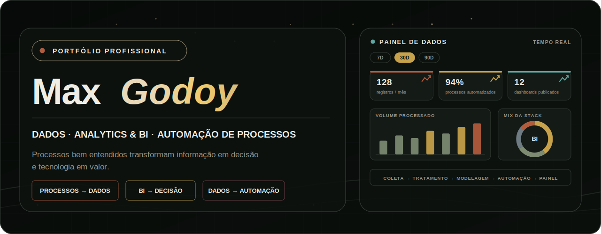
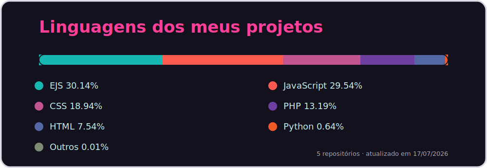
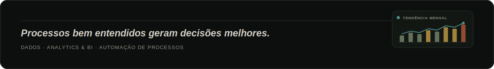

<picture>
  <source media="(prefers-color-scheme: dark)" srcset="./assets/hero-dark.svg">
  <source media="(prefers-color-scheme: light)" srcset="./assets/hero-light.svg">
  
</picture>

 

 

## 👤 Sobre

Estudante do 4º semestre de Desenvolvimento de Software Multiplataforma (FATEC Zona Sul), em transição da área jurídica/societária — 12 anos lidando com contratos, prazos e análise de risco — para Dados e Analytics. Essa vivência é a base para entender a regra de negócio antes de modelar ou escrever código.

Aplico isso em projetos reais com **Python, SQL, MongoDB, Power BI, Node.js e JavaScript**, além de ter fundado o **BASE LAB FATEC**, comunidade de apoio a outros alunos. Busco estágio em **Dados, Analytics, BI e/ou Automação de Processos**.

 

 

<table width="100%">
<tr>

<td align="center" width="29%" valign="top">

## ⏳ Experiência

### +12 anos

Vivência profissional em ambientes jurídico-societários, com foco em contratos, prazos, análise de risco e regra de negócio.

</td>

<td align="center" width="42%" valign="top">

## 🎓 Formação

### Desenvolvimento de Software Multiplataforma

**FATEC - Zona Sul**

 

 

 

 

</td>

<td align="center" width="29%" valign="top">

## 🎯 Objetivo
 

Estágio em **Dados, Analytics & BI | Automação de Processos**.

</td>

</tr>
</table>

 

# 🏆 PROJETOS EM DESTAQUE

| Projeto | Modelo de Negócio | Stack | Links |
|:-:|---|---|---|
| **Power BI Portfolio** | Portfólio de Business Intelligence |     |   |
| **Studio Patty Leão** | ERP Monolítico — gestão, vitrine digital, agendamentos e institucional |     |   |
| **EntreLaços** | Vitrine Digital para Artesanato |     |   |
| **InteliBolsas** | Sistema de Gestão Acadêmica |      |  |

Legenda de problema → solução de cada projeto disponível no README do respectivo repositório (link "GitHub" acima).

 

# 📊 LINGUAGENS DOS MEUS PROJETOS

Distribuição automática das linguagens detectadas nos meus **repositórios públicos**, com percentuais atualizados pelo GitHub Actions.

> ⚠️ **Ação necessária após o upload:** o arquivo `assets/generated/language-activity-*.svg` deste pacote está no estado de placeholder ("Aguardando a primeira sincronização", 0 repositórios) porque a última geração local rodou com um usuário diferente do configurado no workflow. Depois de subir este repositório, rode a Action **"Atualizar linguagens dos projetos"** manualmente uma vez (aba Actions → Run workflow) para popular o gráfico com dados reais antes de divulgar o perfil.

<picture>
  <source media="(prefers-color-scheme: dark)" srcset="./assets/generated/language-activity-dark.svg">
  <source media="(prefers-color-scheme: light)" srcset="./assets/generated/language-activity-light.svg">
  
</picture>

 

<strong>Como os percentuais são calculados?</strong>

 

A automação consulta os meus repositórios públicos e utiliza a classificação de linguagens do próprio GitHub para calcular a participação de cada linguagem no conjunto dos projetos.

São desconsiderados:

- o repositório deste perfil;
- forks;
- repositórios arquivados;
- linguagens fora do limite de exibição, agrupadas em **Outros**.

O cálculo usa a quantidade de bytes identificados pelo GitHub Linguist. A métrica representa a composição dos projetos publicados, e não nível de domínio técnico.

 

# 🔬 BASE LAB & CONTATO

<table width="100%">
<tr>
<td width="55%" align="center" valign="top">

## BASE LAB

Comunidade que fundei na FATEC para aproximar estudantes por meio de **encontros, desafios de programação, compartilhamento de materiais e conversas sobre projetos e carreira em tecnologia** — nascida da experiência de liderar projetos desde o 1º semestre.

 

</td>
<td width="45%" align="center" valign="top">

## Vamos conversar?

Aberto a oportunidades de estágio, colaboração e projetos em tecnologia, dados e automação.

 

</td>
</tr>
</table>

 

# 🧊 CONTRIBUIÇÕES EM 3D

Histórico de commits renderizado em blocos 3D, atualizado automaticamente pelo GitHub Actions.

 

<picture>
  <source media="(prefers-color-scheme: dark)" srcset="https://raw.githubusercontent.com/maxgodoydev/maxgodoydev/3d-contrib/profile-night-rainbow.svg">
  <source media="(prefers-color-scheme: light)" srcset="https://raw.githubusercontent.com/maxgodoydev/maxgodoydev/3d-contrib/profile-green.svg">
  
</picture>

 

  

<picture>
  <source media="(prefers-color-scheme: dark)" srcset="./assets/footer-dark.svg">
  <source media="(prefers-color-scheme: light)" srcset="./assets/footer-light.svg">
  
</picture>

