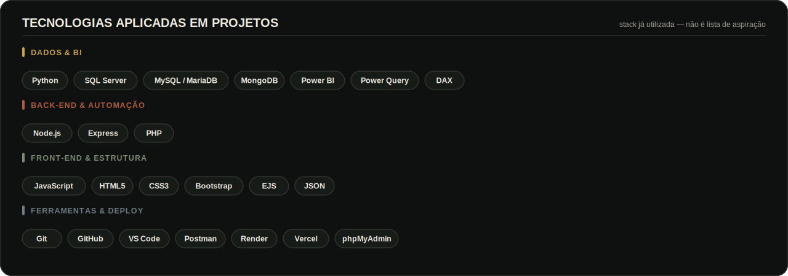

<picture>
  <source media="(prefers-color-scheme: dark)" srcset="./assets/hero-dark.svg">
  <source media="(prefers-color-scheme: light)" srcset="./assets/hero-light.svg">
  
</picture>

 

 

## 👤 Sobre

Estudante do 4º semestre de Desenvolvimento de Software Multiplataforma (FATEC Zona Sul), em transição da área jurídica/societária — 12 anos lidando com contratos, prazos e análise de risco — para Dados e Analytics. Essa vivência é a base para entender a regra de negócio antes de modelar ou escrever código.

Aplico isso em projetos reais com **Python, SQL, MongoDB, Power BI, Node.js e JavaScript**, além de ter fundado o **BASE LAB FATEC**, comunidade de apoio a outros alunos. Busco estágio em **Data Analytics, Data Science, BI ou Engenharia de Dados**.

 

 

<table width="100%">
<tr>

<td align="center" width="29%" valign="top">

## ⏳ Experiência

### +12 anos

Vivência profissional em ambientes jurídico-societários, com foco em contratos, prazos, análise de risco e regra de negócio.

</td>

<td align="center" width="42%" valign="top">

## 🎓 Formação

### Desenvolvimento de Software Multiplataforma

**FATEC - Zona Sul**

 

 

 

 

</td>

<td align="center" width="29%" valign="top">

## 🎯 Objetivo
 

Estágio em **Data Analytics | Data Science | Business Intelligence | Engenharia de Dados**.

</td>

</tr>
</table>

 

# 🏆 PROJETOS EM DESTAQUE

<table width="100%">
<tr>
<td width="50%" align="center" valign="top">

## 📊 Power BI Portfolio

Portfólio de dashboards e estudos voltados à leitura de negócio e tomada de decisão.

**Problema resolvido:** transformar bases e informações dispersas em indicadores visuais comparáveis.

**Solução entregue:** painéis com **KPIs, análises operacionais, modelagem e leituras gerenciais**.

 

  

</td>
<td width="50%" align="center" valign="top">

## 💇 Studio Patty Leão

Sistema web em produção para centralizar a operação de um salão de beleza.

**Problema resolvido:** controles distribuídos entre cadernos, mensagens, folhas e rotinas manuais.

**Solução entregue:** fluxo integrado de **agendamentos, recepção, agenda profissional, reservas presenciais, estoque, financeiro manual e BI básico**.

 

  

</td>
</tr>
</table>

 

<table width="100%">
<tr>
<td width="50%" align="center" valign="top">

## 🧶 EntreLaços

Vitrine digital responsiva criada para organizar a apresentação e o atendimento de produtos artesanais.

**Problema resolvido:** produtos e informações distribuídos entre imagens, mensagens e conversas individuais.

**Solução entregue:** catálogo online com **filtros, dados estruturados em JSON, visualização responsiva e direcionamento para atendimento no WhatsApp**.

 

  

</td>
<td width="50%" align="center" valign="top">

## 🎓 InteliBolsas

Sistema acadêmico desenvolvido para centralizar e organizar oportunidades de bolsas de estudo.

**Problema resolvido:** informações de bolsas, instituições, cursos e usuários sem uma estrutura única para consulta e administração.

**Solução entregue:** aplicação com **CRUD, perfis de acesso e banco relacional MySQL/MariaDB administrado pelo phpMyAdmin**.

 

  

</td>
</tr>
</table>

 

# 🛠️ TECNOLOGIAS E ESTUDOS

Stack já aplicada em projetos reais — sem entrar em ferramenta que eu ainda não usei na prática.

<picture>
  <source media="(prefers-color-scheme: dark)" srcset="./assets/tech-stack-dark.svg">
  <source media="(prefers-color-scheme: light)" srcset="./assets/tech-stack-light.svg">
  
</picture>

 

**Próximos passos (roadmap acadêmico):**

 

> Estudo em andamento nos próximos semestres — não é domínio avançado ainda.

 

# 📊 LINGUAGENS DOS MEUS PROJETOS

Distribuição automática das linguagens detectadas nos meus **repositórios públicos**, com percentuais atualizados pelo GitHub Actions.

> ⚠️ **Ação necessária após o upload:** o arquivo `assets/generated/language-activity-*.svg` deste pacote está no estado de placeholder ("Aguardando a primeira sincronização", 0 repositórios) porque a última geração local rodou com um usuário diferente do configurado no workflow. Depois de subir este repositório, rode a Action **"Atualizar linguagens dos projetos"** manualmente uma vez (aba Actions → Run workflow) para popular o gráfico com dados reais antes de divulgar o perfil.

<picture>
  <source media="(prefers-color-scheme: dark)" srcset="./assets/generated/language-activity-dark.svg">
  <source media="(prefers-color-scheme: light)" srcset="./assets/generated/language-activity-light.svg">
  
</picture>

 

<strong>Como os percentuais são calculados?</strong>

 

A automação consulta os meus repositórios públicos e utiliza a classificação de linguagens do próprio GitHub para calcular a participação de cada linguagem no conjunto dos projetos.

São desconsiderados:

- o repositório deste perfil;
- forks;
- repositórios arquivados;
- linguagens fora do limite de exibição, agrupadas em **Outros**.

O cálculo usa a quantidade de bytes identificados pelo GitHub Linguist. A métrica representa a composição dos projetos publicados, e não nível de domínio técnico.

 

# 🔬 BASE LAB & CONTATO

<table width="100%">
<tr>
<td width="55%" align="center" valign="top">

## BASE LAB

Comunidade que fundei na FATEC para aproximar estudantes por meio de **encontros, desafios de programação, compartilhamento de materiais e conversas sobre projetos e carreira em tecnologia** — nascida da experiência de liderar projetos desde o 1º semestre.

 

</td>
<td width="45%" align="center" valign="top">

## Vamos conversar?

Aberto a oportunidades de estágio, colaboração e projetos em tecnologia, dados e automação.

 

</td>
</tr>
</table>

 

# 🕹️ BREAKOUT DE CONTRIBUIÇÕES

Cada contribuição vira um bloco no jogo, atualizado automaticamente pelo GitHub Actions.

 

<picture>
  <source media="(prefers-color-scheme: dark)" srcset="https://raw.githubusercontent.com/maxgodoydev/maxgodoydev/github-breakout/images/breakout-dark.svg">
  <source media="(prefers-color-scheme: light)" srcset="https://raw.githubusercontent.com/maxgodoydev/maxgodoydev/github-breakout/images/breakout-light.svg">
  
</picture>

 

  

<picture>
  <source media="(prefers-color-scheme: dark)" srcset="./assets/footer-dark.svg">
  <source media="(prefers-color-scheme: light)" srcset="./assets/footer-light.svg">
  
</picture>

