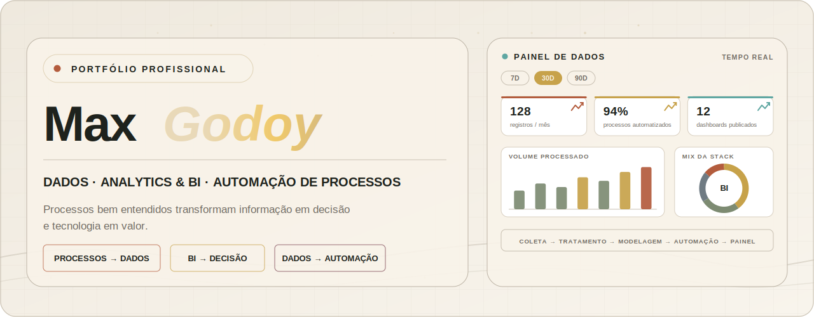
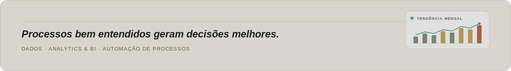

<picture>
  <source media="(prefers-color-scheme: light)" srcset="./assets/hero-light.svg">
  
</picture>

 

 

<table width="100%">
<tr>

<td align="center" width="33%" valign="top">

### ⏳ Experiência

+12 anos em contratos, prazos, análise de risco e regras de negócio em ambiente jurídico-societário.

</td>

<td align="center" width="34%" valign="top">

### 🎓 Formação

**Desenvolvimento de Software Multiplataforma**
[FATEC — Zona Sul](https://fateczonasul.edu.br/)

 

</td>

<td align="center" width="33%" valign="top">

### 🎯 Objetivo

Estágio em **Dados, Analytics & BI** ou **Automação de Processos**.

</td>

</tr>
</table>

 

## 🏆 Projetos em Destaque

| Projeto | Modelo de Negócio | Stack | Links |
|:-:|:-:|:-:|:-:|
| [**📊 Power BI Portfolio**](https://github.com/maxgodoydev/Portfolio_Power_BI)  | Portfólio de Dados, Analytics e Business Intelligence |     |  |
| [**🦁 Studio Patty Leão**](https://github.com/maxgodoydev/Studio_Patty_Leao)  | ERP monolítico — gestão, vitrine digital, agendamentos e institucional |     |   |
| [ **🎀 EntreLaços** ](https://github.com/maxgodoydev/Entrelacos) | Vitrine digital de produtos |     |   |
| [**🎓 InteliBolsas**](https://github.com/maxgodoydev/InteliBolsas) | Sistema de gestão acadêmica |      |  |

Detalhes de problema → solução de cada projeto no README do respectivo repositório.

 

## 📊 GitHub em Números

 

## 🔬 BASE LAB & Contato

<table width="100%">
<tr>
<td width="55%" align="center" valign="top">

### BASE LAB

Comunidade fundada na FATEC para aproximar estudantes com encontros, desafios de programação e troca sobre carreira em tecnologia.

 

</td>
<td width="45%" align="center" valign="top">

### Vamos conversar?

Aberto a oportunidades de estágio, colaboração e projetos em tecnologia, dados e automação.

 

 

 

 

</td>
</tr>
</table>

 

<picture>
  <source media="(prefers-color-scheme: light)" srcset="https://raw.githubusercontent.com/maxgodoydev/maxgodoydev/3d-contrib/profile-green.svg">
  
</picture>

  

  

<picture>
  <source media="(prefers-color-scheme: dark)" srcset="./assets/footer-dark.svg">
  <source media="(prefers-color-scheme: light)" srcset="./assets/footer-light.svg">
  
</picture>

